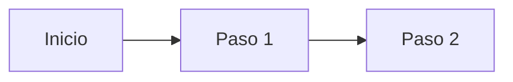

# The Learner Boys

Blog personal de un grupo de amigos. Sin tema fijo — cada uno aporta lo suyo: proyectos, ideas, gustos, y lo que vaya surgiendo.

**Sitio publicado:** [mvalentne.github.io/Blog_TheLearnerBoys](https://mvalentne.github.io/Blog_TheLearnerBoys/)

---

## Indice

1. [Que necesitas instalar](#1-que-necesitas-instalar)
2. [Crear cuenta de GitHub](#2-crear-cuenta-de-github)
3. [Instalar Git](#3-instalar-git)
4. [Configurar Git](#4-configurar-git)
5. [Generar clave SSH y conectarla a GitHub](#5-generar-clave-ssh-y-conectarla-a-github)
6. [Instalar Hugo](#6-instalar-hugo)
7. [Clonar el repositorio del blog](#7-clonar-el-repositorio-del-blog)
8. [Ver el blog en tu computadora](#8-ver-el-blog-en-tu-computadora)
9. [Crear un post nuevo](#9-crear-un-post-nuevo)
10. [Escribir tu post](#10-escribir-tu-post)
11. [Ver tu post en el blog (local)](#11-ver-tu-post-en-el-blog-local)
12. [Publicar en internet](#12-publicar-en-internet)
13. [Referencia rapida](#13-referencia-rapida)
14. [Solucion de problemas](#14-solucion-de-problemas)

---

## 1. Que necesitas instalar

Para publicar en el blog necesitas tres cosas:

| Herramienta | Para que sirve | Donde bajarla |
|---|---|---|
| **Git** | Guardar y sincronizar cambios del blog | [git-scm.com](https://git-scm.com/downloads) |
| **Hugo** | Generar el sitio web desde archivos de texto | [gohugo.io](https://gohugo.io/installation/) |
| **Cuenta de GitHub** | Donde esta alojado el blog y donde subis los cambios | [github.com](https://github.com) |

> Si ya tenes Git y Hugo instalados, podes saltear directamente al [Paso 7](#7-clonar-el-repositorio-del-blog).

---

## 2. Crear cuenta de GitHub

1. Abrí tu navegador y andá a **[github.com](https://github.com)**
2. Hacé click en **"Sign up"** (arriba a la derecha)
3. Seguí los pasos:
   - Ingresá tu email
   - Creá una contraseña
   - Elegí un nombre de usuario (esto es como te van a ver los demas)
   - Completá el captcha
4. Verificá tu email (te van a mandar un codigo)

Listo, ya tenes cuenta de GitHub.

---

## 3. Instalar Git

### Windows (paso a paso)

1. Andá a **[git-scm.com/downloads](https://git-scm.com/downloads)**
2. Hacé click en **"Download for Windows"**
3. Abrí el archivo `.exe` que se descargo
4. Seguí el instalador con estas opciones:
   - **License**: aceptá y dale "Next"
   - **Destination Location**: dejá la ruta por defecto, "Next"
   - **Components**: dejá todo marcado como esta, "Next"
   - **Default editor**: elegí **"Use Vim (the ubiquitous text editor as Git's default editor)"** o **"Use the Nano editor by default"** si preferis algo mas simple, "Next"
   - **Adjusting your PATH**: elegí **"Git from the command line and also from 3rd-party software"** (la opcion recomendada), "Next"
   - **SSH executable**: dejá **"Use bundled OpenSSH"**, "Next"
   - **HTTPS transport backend**: dejá **"Use the OpenSSL library"**, "Next"
   - **Line ending conversions**: elegí **"Checkout as-is, commit as-is"** (esto es importante para que no se rompan los archivos), "Next"
   - **Terminal emulator**: dejá **"Use MinTTY"**, "Next"
   - **Default branch name**: dejá lo que sea (probablemente `master` o `main`), "Next"
   - **Credential helper**: dejá **"Git Credential Manager"**, "Next"
   - **Extra options**: dejá "Enable file system caching" marcado, "Next"
   - "Install"

5. Cuando termine, desmarcá "View Release Notes" y hacé click en "Finish"

### Linux

En una terminal, ejecutá:

```bash
# Debian / Ubuntu
sudo apt update && sudo apt install git -y

# Fedora
sudo dnf install git -y

# Arch
sudo pacman -S git
```

### macOS

Si tenes [Homebrew](https://brew.sh/) instalado:

```bash
brew install git
```

Si no lo tenes, instalalo primero con esto en la terminal:

```bin/bash
/bin/bash -c "$(curl -fsSL https://raw.githubusercontent.com/Homebrew/install/HEAD/install.sh)"
```

### Verificar que se instalo bien

Abrí una terminal y escribí:

```bash
git --version
```

Deberia aparecer algo como `git version 2.xx.x`. Si te dice que no reconoce el comando, significa que Git no se instalo correctamente o no esta en el PATH.

---

## 4. Configurar Git

Abrí una terminal y ejecuta estos dos comandos, reemplazando con tus datos reales:

```bash
git config --global user.name "Tu nombre"
git config --global user.email "tu@email.com"
```

> Usá el mismo email que usaste para crear la cuenta de GitHub.

**Para que sirve:** Git necesita saber quien sos para poder firmar tus cambios con tu nombre y email. Sin esto, no vas a poder guardar cambios.

Para verificar que quedo bien:

```bash
git config --global user.name
git config --global user.email
```

Deberia mostrarte el nombre y email que acabas de configurar.

---

## 5. Generar clave SSH y conectarla a GitHub

La clave SSH es como una "contraseña digital" que le permite a tu computadora hablar con GitHub de forma segura. Sin esto, no vas a poder subir cambios al blog.

### Windows

1. Abrí **Git Bash** (buscalo en el menu de Windows, es una app que se instalo junto con Git)

2. Generá la clave ejecutando:

```bash
ssh-keygen -t ed25519 -C "tu@email.com"
```

> Pone el mismo email que usaste en el paso anterior.

3. Cuando te pregunte donde guardarla, **dole Enter** (dejá la ruta por defecto)
4. Cuando te pregunte una contraseña (passphrase), **dole Enter** dos veces (dejala vacia por ahora)

5. Ahora copia la clave publica al portapapeles:

```bash
cat ~/.ssh/id_ed25519.pub | clip
```

> Si `clip` no funciona, abri el explorador de archivos, escribe `%USERPROFILE%\.ssh` en la barra de direcciones, abri el archivo `id_ed25519.pub` con el Bloc de notas, selecciona todo (Ctrl+A) y copia (Ctrl+C).

### Linux / macOS

1. Abrí la terminal

2. Generá la clave:

```bash
ssh-keygen -t ed25519 -C "tu@email.com"
```

3. Dale Enter dos veces (ruta por defecto, sin contraseña)

4. Inicia el agent y agrega la clave:

```bash
eval "$(ssh-agent -s)"
ssh-add ~/.ssh/id_ed25519
```

5. Copia la clave publica:

```bash
cat ~/.ssh/id_ed25519.pub
```

Seclcciona todo lo que aparece en pantalla y copialo (Ctrl+Shift+C en muchas terminales, o clic derecho -> copiar).

### Agregar la clave a GitHub

1. Andá a **[github.com](https://github.com)** ylogueate
2. Hacé click en tu foto de perfil (arriba a la derecha) -> **"Settings"**
3. En el menu de la izquierda, hacé click en **"SSH and GPG keys"**
4. Hacé click en **"New SSH key"**
5. En el campo **"Title"** pone algo descriptivo, por ejemplo: "Mi PC"
6. En el campo **"Key"** pega la clave que copiaste (Ctrl+V)
7. Hacé click en **"Add SSH key"**

### Verificar que funciona

En la terminal (Git Bash en Windows, o la terminal normal en Linux/macOS):

```bash
ssh -T git@github.com
```

Si te sale un mensaje que dice `Hi usuario! You've successfully authenticated`, esta todo bien. Si te pregunta si queres continuar, escribí `yes` y dale Enter.

---

## 6. Instalar Hugo

### Windows (paso a paso)

1. Andá a **[github.com/gohugoio/hugo/releases](https://github.com/gohugoio/hugo/releases)**
2. Busca la version mas reciente y descarga el archivo **`hugo_X.xx.x_windows-amd64.zip`** (donde X.xx.x es el numero de version)
3. Una vez descargado, extrae el contenido del zip. Va a salir un archivo llamado `hugo.exe`
4. **Copialo** a una carpeta permanente, por ejemplo: `C:\hugo\` (creala si no existe)
   - Es importante que no lo dejes en Descargas porque si limpias esa carpeta lo perdes
5. Ahora necesitas agregar Hugo al PATH de Windows para que pueda usarlo desde cualquier terminal:
   - Presioná la tecla **Windows** y escribí **"variables de entorno"**
   - Hacé click en **"Editar las variables de entorno del sistema"**
   - Hacé click en el boton **"Variables de entorno..."** (abajo)
   - En la seccion **"Variables del sistema"** (la de abajo), busca la variable **"Path"** y seleccionala
   - Hacé click en **"Editar..."**
   - Hacé click en **"Nuevo"** y escribi la ruta donde guardaste hugo.exe, por ejemplo: `C:\hugo`
   - Dale **Aceptar** en todas las ventanas
6. **Cerra y volve a abrir** cualquier terminal que tengas abierta (esto es importante, sino no reconoce el cambio)

### Linux

En una terminal:

```bash
# Debian / Ubuntu (usando snap)
sudo snap install hugo

# Fedora
sudo dnf install hugo

# Arch
sudo pacman -S hugo
```

### macOS

```bash
brew install hugo
```

### Verificar que se instalo bien

Abrí una terminal y escribí:

```bash
hugo version
```

Deberia aparecer algo como `hugo v0.xxx.x-xxxxxx`. Si te dice que no reconoce el comando, revisa que hayas seguido bien los pasos del PATH (Windows) o que la terminal este abierta despues de la instalacion.

---

## 7. Clonar el repositorio del blog

"Clonar" significa descargar el blog completo a tu computadora. Es como bajar una carpeta, pero con la ventaja de que podes sincronizar cambios despues.

### Primero: decidí donde queres tener el blog

Elegi una carpeta donde queres que viva el blog en tu PC. Por ejemplo:
- **Windows:** `C:\Users\TuUsuario\Documents\` o `C:\Users\TuUsuario\Escritorio\`
- **Linux / macOS:** Tu carpeta home (`~`) o `~/Documents/`

### Clonar

Abrí la terminal, navega a la carpeta que elegiste, y ejecuta:

**Windows (Git Bash):**

```bash
cd /c/Users/TuUsuario/Documents
git clone --recurse-submodules git@github.com:MValentne/Blog_TheLearnerBoys.git
cd Blog_TheLearnerBoys
```

**Linux / macOS:**

```bash
cd ~/Documents
git clone --recurse-submodules git@github.com:MValentne/Blog_TheLearnerBoys.git
cd Blog_TheLearnerBoys
```

> Reemplazá `TuUsuario` con tu nombre de usuario real de Windows.

**Para que sirve `--recurse-submodules`:** El blog usa un "tema" (el diseño visual) que esta alojado como un repositorio separado dentro del proyecto. Sin esta bandera, el tema no se descarga y el blog no funciona.

### Si ya clonaste sin el submodulo

Si por error clonaste sin `--recurse-submodules`, podes inicializarlo despues:

```bash
cd Blog_TheLearnerBoys
git submodule update --init
```

---

## 8. Ver el blog en tu computadora

Hugo tiene un "servidor de desarrollo" que genera el blog en tu PC y se actualiza solo cada vez que guardas un archivo. Nadie mas puede verlo, es solo para vos.

1. Asegurate de estar dentro de la carpeta del blog:

```bash
cd Blog_TheLearnerBoys
```

2. Ejecuta:

```bash
hugo server -D
```

3. Abrí tu navegador y andá a:

```
http://localhost:1313/Blog_TheLearnerBoys/
```

Ahi vas a ver el blog tal cual se ve en internet. Cada vez que guardas un archivo `.md`, el navegador se actualiza automaticamente.

> El flag `-D` hace que se muestren los posts que estan en "borrador" (draft). Sin el, solo se ven los posts publicados.

Para **cerrar** el servidor, andá a la terminal y presioná **Ctrl + C**.

---

## 9. Crear un post nuevo

1. Asegurate de estar en la terminal dentro de la carpeta del blog

2. Ejecuta (reemplazá `tu-nombre` y `nombre-del-post`):

```bash
hugo new content posts/tu-nombre/nombre-del-post.md
```

**Ejemplo:** si tu nombre es "Lucas" y queres escribir sobre "Mi viaje a Bariloche":

```bash
hugo new content posts/lucas/mi-viaje-a-bariloche.md
```

> No uses espacios ni tildes en el nombre del archivo. Usa guiones `-` para separar palabras.

3. Abrí el archivo que se creo con un editor de texto. Podes usar:
   - **VS Code** (recomendado): [code.visualstudio.com](https://code.visualstudio.com/) — gratis, tiene muchas features utiles
   - **Notepad++** (Windows): [notepad-plus-plus.org](https://notepad-plus-plus.org/) — gratis, liviano
   - **Bloc de notas** de Windows: funciona, pero no resalta el codigo ni formatea bien
   - En **Linux / macOS**: nano, vim, o cualquier editor que te guste

El archivo esta en: `content/posts/tu-nombre/nombre-del-post.md`

### El frontmatter

Lo primero que vas a ver en el archivo es algo asi:

```toml
+++
title = 'Nombre Del Post'
date = 2026-08-25T12:00:00-03:00
draft = true
author = 'Tu nombre'
keywords = ['tag1', 'tag2']
categories = ['Blog']
+++
```

Esto se llama **frontmatter** y es informacion sobre tu post. Los campos son:

| Campo | Que es | Que poner |
|---|---|---|
| `title` | Titulo del post | El titulo que quieras, entre comillas simples |
| `date` | Fecha de publicacion | La fecha y hora actual en formato ISO (ya viene puesta) |
| `draft` | Si es borrador o no | `true` = no se publica, `false` = se publica. **Dejalo en `true` mientras escribis** |
| `author` | Tu nombre | Tu nombre, entre comillas simples |
| `keywords` | Tags del post | Palabras clave entre corchetes y comillas, separadas por comas |
| `categories` | Categoria del post | La categoria a la que pertenece el post |

**IMPORTANTE:** Mientras estes escribiendo, dejá `draft = true`. Cuando termines el post y quieras publicarlo, cambialo a `draft = false`.

---

## 10. Escribir tu post

Debajo del frontmatter (debajo de los `+++`), escribi tu contenido usando **Markdown**. Markdown es un formato muy simple que usa simbolos para formatear texto.

### Formateo basico de Markdown

| Quiero... | Escribo... |
|---|---|
| Titulo grande | `# Titulo` |
| Subtitulo | `## Subtitulo` |
| Sub-subtitulo | `### Sub-subtitulo` |
| Texto en negrita | `**texto en negrita**` |
| Texto en cursiva | `*texto en cursiva*` |
| Lista con puntos | `- item 1` + Enter + `- item 2` |
| Lista numerada | `1. item 1` + Enter + `2. item 2` |
| Link | `[texto del link](https://ejemplo.com)` |
| Cita | `> Texto de cita` |
| Linea horizontal | `---` |

**Ejemplo de como se ve un post:**

```markdown
# Mi viaje a Bariloche

## El viaje en colectivo

Salimos de Buenos Aires a las **22:00** y llegamos a las *8:00 de la manana*.

Cosas que lleve:

- Mochila
- Ropa de abrigo
- Camara fotografica

## El lago Nahuel Huapi

El lago es impresionante. Si queres saber mas, [aqui hay info](https://es.wikipedia.org/wiki/Lago_Nahuel_Huapi).

> "No hay nada mas lindo que Bariloche en invierno" — alguien

---

Espero que les guste el post!
```

### Agregar imagenes

Las imagenes no van en el repositorio. Se suben a un servicio externo y se pone el link.

1. Andá a **[postimages.org](https://postimages.org/)**
2. Hacé click en **"Choose files"** y seleccioná tu imagen
3. Cuando termine de subir, copia la URL que aparece en **"Direct link"** (la que termina en `.png` o `.jpg`)
4. En tu post, pega:

```markdown

```

**Ejemplo:**

```markdown

```

### Embeber un video de YouTube

Copia el ID del video (la parte que esta despues de `v=` en la URL) y usa este shortcode:

```markdown

```

**Ejemplo:** si el video es `https://www.youtube.com/watch?v=dQw4w9WgXcQ`:

```markdown

```

### Formulas matemáticas (opcional)

Si necesas escribir formulas de matematica:

- Formula dentro del texto: `$E = mc^2$`
- Formula en bloque centrada:

```markdown
$$
\int_a^b f(x)\,dx
$$
```

Esto usa KaTeX y funciona automaticamente, no necesitas instalar nada extra.

### Diagramas (opcional)

Para hacer diagramas simples con texto:

````markdown

````

### HTML directo

El blog permite usar HTML dentro del Markdown. Si necesas algo que Markdown no puede (como un iframe de Spotify, un video embebido custom, etc.), podes usar HTML directo.

---

## 11. Ver tu post en el blog (local)

1. Si ceraste el servidor, vuelvelo a abrir:

```bash
hugo server -D
```

2. Andá al navegador en `http://localhost:1313/Blog_TheLearnerBoys/`
3. Buscá tu post. Debería aparecer en la pagina principal o en la seccion correspondiente
4. Cada vez que guardas el archivo `.md`, el navegador se actualiza solo

> Si no aparece, revisa que el frontmatter este bien (sin errores de formato) y que `draft = true` este puesto (ya que el servidor esta con `-D`).

Para probar como se veria publicado (sin drafts), cambia `draft = true` a `draft = false` en el frontmatter, guarda, y refrescá el navegador sin el flag `-D`:

```bash
# Cerra el servidor actual (Ctrl+C) y vuelvelo a abrir SIN -D
hugo server
```

---

## 12. Publicar en internet

Cuando tu post esta listo y queres que todos lo vean:

### Paso 1: Cambiar draft a false

En el frontmatter de tu post, cambia:

```toml
draft = true
```

por:

```toml
draft = false
```

### Paso 2: Guardar y subir los cambios a GitHub

En la terminal, dentro de la carpeta del blog:

```bash
git add .
git commit -m "Agrego post: Titulo de tu post"
git push origin master
```

**Que hace cada comando:**
- `git add .` — Marca todos los archivos modificados para ser guardados
- `git commit` — Guarda los cambios con un mensaje descriptivo
- `git push` — Sube los cambios a GitHub

### Paso 3: Deployar (publicar el sitio)

El deploy es lo que toma el codigo del blog y lo convierte en el sitio web que se ve en internet.

**Windows:** Hace doble clic en el archivo **`deploy.bat`** que esta en la carpeta del blog. Se va a abrir una ventana de PowerShell y va a hacer todo automaticamente.

**Linux / macOS:** En la terminal:

```bash
bash deploy.sh
```

**Windows (PowerShell):** Tambien podes usar PowerShell directamente:

```powershell
.\deploy.ps1
```

El script hace todo automaticamente:
1. Verifica que estes en la rama `master`
2. Genera el sitio con Hugo
3. Publica el resultado en la rama `gh-pages` (que es donde GitHub Pages lee el sitio)
4. Sube los cambios a GitHub

Cuando termine, vas a ver un mensaje que dice algo como "Sitio publicado en: https://mvalentne.github.io/Blog_TheLearnerBoys/"

### Paso 4: Esperar

GitHub Pages tarda entre **1 y 5 minutos** en actualizar el sitio. Andá a [mvalentne.github.io/Blog_TheLearnerBoys](https://mvalentne.github.io/Blog_TheLearnerBoys/) y refrescá la pagina. Tu post deberia aparecer.

---

## 13. Referencia rapida

### Frontmatter completo

```toml
+++
title = 'Titulo Del Post'
date = 2026-08-25T12:00:00-03:00
draft = false
author = 'Tu nombre'
keywords = ['tag1', 'tag2', 'tag3']
categories = ['Blog']
toc = true            # opcional: muestra tabla de contenidos
tocBorder = true      # opcional: agrega borde a la tabla de contenidos
+++
```

### Estructura de carpetas

```
Blog_TheLearnerBoys/
├── content/
│   └── posts/           # ← Aca van tus posts
│       ├── tu-nombre/   # ← Subcarpeta por autor
│       │   └── mi-post.md
│       └── otro-amigo/
│           └── otro-post.md
├── layouts/             # NO tocar (son configuraciones del tema)
├── themes/              # NO tocar (es el tema visual)
├── hugo.toml            # Configuracion general (no tocar)
├── deploy.bat           # Script de deploy para Windows
├── deploy.sh            # Script de deploy para Linux/macOS
└── deploy.ps1           # Script de deploy para PowerShell
```

### Secciones del blog

| Seccion | Donde van los archivos | Para que sirve |
|---|---|---|
| **Posts** | `content/posts/` | Posts normales del blog |
| **Hilos** | `content/hilos/` | Series de posts conectados (ej: notas de una materia) |
| **La pared** | `content/pared/` | Galeria de dibujos |

### Como crear un hilo (serie de posts)

Un hilo es una serie de posts que van juntos, como notas de cursada.

1. Crear la carpeta del hilo:

```bash
mkdir -p content/hilos/nombre-del-hilo
```

2. Crear el indice del hilo en `content/hilos/nombre-del-hilo/_index.md`:

```toml
+++
title = 'Titulo del Hilo'
date = 2026-08-25T12:00:00-03:00
draft = false
author = 'Tu nombre'
keywords = ['tag1', 'tag2']
categories = ['Categoria']
+++
```

3. Crear los posts del hilo como archivos `.md` dentro de esa carpeta

### Comandos Git basicos

| Comando | Que hace |
|---|---|
| `git status` | Muestra que archivos cambiaste |
| `git add .` | Marca todos los cambios para guardar |
| `git commit -m "mensaje"` | Guarda los cambios con un mensaje |
| `git push` | Sube los cambios a GitHub |
| `git pull` | Baja los ultimos cambios de GitHub a tu PC |
| `git log --oneline -5` | Muestra los ultimos 5 commits |

> **Siempre** ejecuta `git pull` antes de empezar a trabajar para tenes los ultimos cambios.

---

## 14. Solucion de problemas

### "git" no se reconoce como comando interno o externo

**Causa:** Git no se instalo bien o no esta en el PATH.

**Solucion:** Reinstala Git desde [git-scm.com](https://git-scm.com/downloads) y asegurate de marcar la opcion "Git from the command line" durante la instalacion. Despues reinicia la terminal.

### "hugo" no se reconoce como comando interno o externo

**Causa:** Hugo no esta en el PATH.

**Solucion (Windows):** Revisa que hayas agregado la carpeta donde esta `hugo.exe` al PATH (ver [Paso 6](#6-instalar-hugo)). Despues **cierra y volve a abrir** la terminal.

### Permission denied (publickey)

**Causa:** La clave SSH no esta configurada o no esta agregada en GitHub.

**Solucion:** Segui el [Paso 5](#5-generar-clave-ssh-y-conectarla-a-github) otra vez. Asegurate de que la clave publica que copiaste sea la misma que pegaste en GitHub.

### "submodule" no funciona

**Causa:** Clonaste sin `--recurse-submodules`.

**Solucion:**

```bash
git submodule update --init
```

### Mi post no aparece en el blog

**Causas posibles:**

1. **`draft` esta en `true`:** Cambialo a `false` en el frontmatter
2. **Error en el frontmatter:** Revisa que los `+++` esten bien, que no falten comas, y que las comillas esten bien cerradas
3. **Nombre de archivo con espacios o tildes:** Renombra el archivo sin espacios ni tildes, usando guiones

### El deploy falla

**Causa comun:** No estas en la rama `master`.

**Solucion:**

```bash
git branch
```

Si no dice `* master`, cambia a esa rama:

```bash
git checkout master
```

Y volve a intentar el deploy.

### El servidor local no muestra los cambios

**Solucion:** Cerra el servidor (Ctrl+C) y vuelvelo a abrir:

```bash
hugo server -D
```

### Quiero actualizar el blog con los cambios de otros autores

Antes de empezar a trabajar:

```bash
git pull origin master
```

Esto baja los ultimos cambios de GitHub a tu PC.
