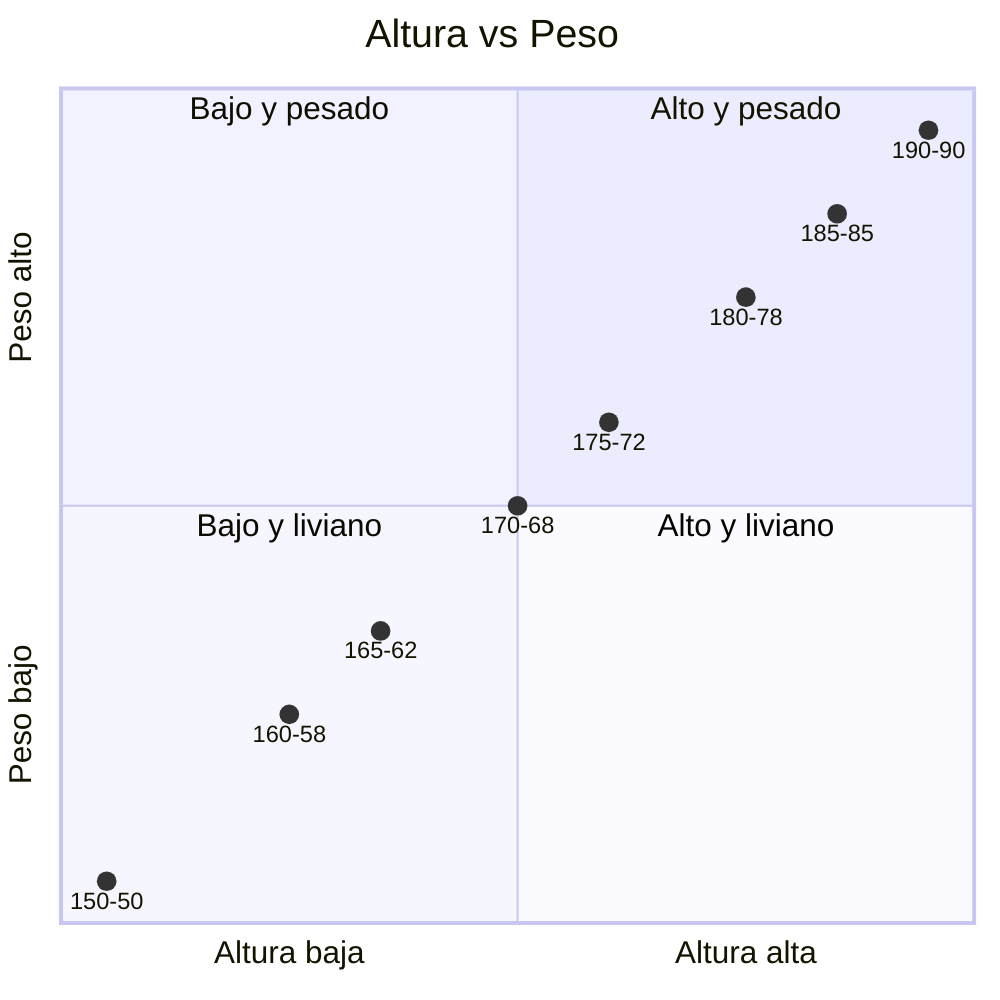
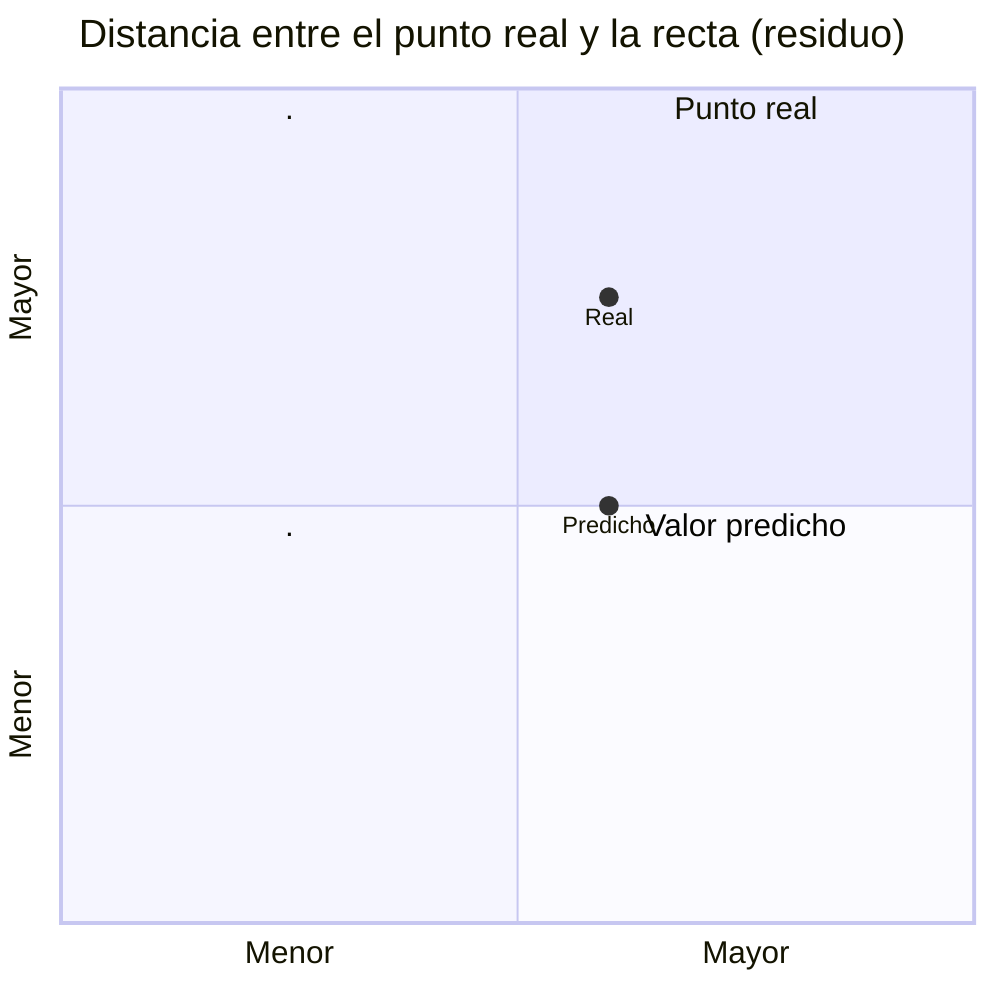

+++
date = '2026-08-10T18:17:40-03:00'
draft = false
title = 'Estadistica Descriptiva Bivariante Y Regresion Lineal'
author = 'Valen'
keywords = ["inferencia", "regresion"]
categories = ["Estadistica"]
toc = true
tocBorder = true
+++

# Introduccion
Empecemos hablando sobre la regresion, es un concepto introducido en 1889 por Francis Galton.

> Galton fue un biólogo, estadistico y aventurero, primo de Charles Darwin, fundador (junto a otros) de la estadistica moderna. Su trabajo se centró en la descripcion de rasgos fisicos en los decendientes (una variable) a partir de los rasgos fisicos de los padres (otra variable).

Este hombre planteó lo siguiente: *"Cada peculiaridad de un hombre es compartida por sus descendientes, pero en media, en un grado menor"*; hablando sobre una regresion en la media. 

Pearson (en relacion a Galton) hizo un estudio con mas de 1000 registros de grupos familiares observando la relacion entre la altura del hijo con su padre:

$$85cm + 0.5 \text{ altura de su padre(aprox)}$$

> Los hijos heredan parte de la altura de sus padres, pero eventualmente regresan a la media.

Hoy en dia la regresion consiste en la prediccion de una medida basandonos en el conocimiento de otra; digase, nos permite estudiar la relacion entre dos variables, y con base a esa relacion poder hacer estimaciones.

En el contenido de este capitulo nos vamos a limitar a una regresion lineal, ya que es facil de interpretar, pero cabe aclarar que podrian llegar a haber curvaturas en una regresion.

# Diagrama de dispersión
De aqui viene el titulo de estadistica descriptiva bivariante, ya que nosotros analizamos la relacion entre dos variables. Vease una tabla con dos variables:

| Altura (cm) | Peso (kg) |
|---|---|
| 150 | 50 |
| 160 | 58 |
| 165 | 62 |
| 170 | 68 |
| 175 | 72 |
| 180 | 78 |
| 185 | 85 |
| 190 | 90 |

Podemos visualizar estas dos variables en un diagrama de dispersión, pero primero tenemos que definir cual es la variable dependiente y cual es la independiente.

$$x \implies y$$
$$x \equiv \text{altura}$$
$$y \equiv \text{peso}$$

Entonces al graficar:

Y podemos ver si hay alguna relacion entre ambas variables. En este caso vemos que hay una relacion bastante directa entre ambas, ya que a mayor altura, mayor peso. Visualmente podemos concluir que hay una relacion lineal positiva entre ambas variables, y a partir de la formula de la pendiente podemos empezar a hacer estimaciones, a esto lo llamaremos modelo regresivo.

>$$y = mx + b$$

donde:
$$y \equiv \text{dependiente}$$
$$x \equiv \text{independiente}$$
$$b \equiv \text{costo fijo}$$
$$m \equiv \text{pendiente}$$

Cuestiones matematicas elementales que usaremos para estimar con este modelo. Tambien, a la forma generada por los puntos se le llama la nube de puntos. Y si al llegar a la forma de la pendiente, probamos con dos puntos cualesquiera a lo largo del eje x, podemos formar la recta de regresion, una recta que cruza la nube de puntos para ver que tanto se aleja cada punto del comportamiento esperado de la relacion.

# Correlación lineal de Pearson

Antes de animarnos a construir una recta que prediga valores, necesitamos saber qué tan fuerte es la relación lineal entre las dos variables. Para eso usamos el coeficiente de correlación de Pearson, que se denota con $r$.

$$r = \frac{\sum (x_i - \bar{x})(y_i - \bar{y})}{\sqrt{\sum (x_i - \bar{x})^2 \sum (y_i - \bar{y})^2}}$$

Este coeficiente siempre toma un valor entre $-1$ y $1$, y siguiendo un criterio podemos determinar cuan fuerte es una relacion:

| Valor de $r$ | Interpretación |
|---|---|
| $r = 1$ | Correlación lineal positiva perfecta |
| $0.7 \leq r < 1$ | Correlación positiva fuerte |
| $0.3 \leq r < 0.7$ | Correlación positiva moderada |
| $r \approx 0$ | Prácticamente no hay correlación lineal |
| $-0.7 \leq r < -0.3$ | Correlación negativa moderada |
| $-1 < r \leq -0.7$ | Correlación negativa fuerte |
| $r = -1$ | Correlación lineal negativa perfecta |

> Un $r$ cercano a 0 no significa que no haya relación entre las variables, sino que no hay una relación lineal. Podría existir una relación cuadrática, exponencial, etc., y Pearson no la va a detectar. Simplemente no hay evidencia de que siga un modelo lineal.

Con nuestro ejemplo de altura y peso, si calculáramos $r$ nos daría un valor cercano a $0.99$, confirmando lo que ya intuíamos al ver el diagrama de dispersión: una relación lineal positiva y muy fuerte. (Me pasa por usar datasets flojos jajaja)

Es importante aclarar algo que se repite mucho en estadística: correlación no implica causalidad. Que dos variables se muevan juntas no quiere decir que una sea la causa de la otra; podría haber una tercera variable interviniendo, o simplemente ser una coincidencia.

# Regresión lineal simple

Una vez que confirmamos que existe una correlación lineal considerable, podemos avanzar a construir el modelo de regresión. El objetivo es encontrar la recta que mejor se ajuste a la nube de puntos, es decir, la que minimice la distancia entre los valores observados y los valores predichos por la recta. 

> Nosotros hablamos informalmente de esto como la formula de la pendiente, pero la idea es exactamente la misma ya que nos interesa el valor geometrico que tiene.

A este método se lo conoce como método de mínimos cuadrados ordinarios (MCO), y busca minimizar la suma de los cuadrados de los residuos (ya vamos a hablar de residuos en la próxima sección).

Recordando la ecuación de la recta:

$$\hat{y} = b_0 + b_1 x$$

donde:
$$\hat{y} \equiv \text{valor estimado (predicho) de } y$$
$$b_0 \equiv \text{ordenada al origen}$$
$$b_1 \equiv \text{pendiente de la recta}$$

Las fórmulas para obtener estos coeficientes mediante mínimos cuadrados son:

$$b_1 = \frac{\sum (x_i - \bar{x})(y_i - \bar{y})}{\sum (x_i - \bar{x})^2}$$

$$b_0 = \bar{y} - b_1 \bar{x}$$

> Notese que el numerador de $b_1$ es el mismo que usamos en la fórmula de Pearson. Esto no es casualidad: la pendiente de la recta de regresión está directamente relacionada con la fuerza de la correlación.

**Interpretación de $b_1$:** por cada unidad que aumenta $x$, se espera que $y$ aumente (o disminuya, si $b_1$ es negativo) en $b_1$ unidades.

**Interpretación de $b_0$:** es el valor esperado de $y$ cuando $x = 0$. Ojo, esta interpretación no siempre tiene sentido práctico (por ejemplo, no existe una persona con altura 0), así que hay que usarla con cuidado según el contexto.

Con estos coeficientes ya calculados, podemos usar la recta para **estimar** valores de $y$ para valores de $x$ que ni siquiera están en nuestra tabla original. Por ejemplo, ¿cuánto pesaría (aproximadamente) alguien de 178 cm?

$$\hat{y} = b_0 + b_1 (178)$$

Eso sí: hay que tener cuidado de no extrapolar demasiado lejos del rango de datos observado (en este caso, fuera del rango 150-190 cm), porque no tenemos garantías de que la relación lineal se mantenga fuera de ese intervalo.

# Residuos (error residual)

Ya dijimos que la recta de regresión es la que "mejor se ajusta", pero en la práctica ningún punto real cae exactamente sobre la recta (salvo casos excepcionales). A la diferencia entre el valor observado y el valor estimado por el modelo se la llama **residuo** o **error residual**, y se denota $e_i$:

$$e_i = y_i - \hat{y}_i$$

Es decir, es la distancia vertical entre cada punto real y la recta de regresión.

Algunas propiedades importantes de los residuos:

- La suma de todos los residuos siempre da $0$ (por construcción del método de mínimos cuadrados).
- Justamente por eso, no podemos usar la suma directa de los residuos como medida de error; se usa la suma de los cuadrados de los residuos (SCE, o en inglés *SSE*):

$$SCE = \sum e_i^2 = \sum (y_i - \hat{y}_i)^2$$

- Un residuo positivo indica que el modelo subestimó ese valor (el valor real quedó por encima de la recta).
- Un residuo negativo indica que el modelo sobreestimó ese valor (el valor real quedó por debajo de la recta).

Analizar el patrón de los residuos también nos sirve para validar si un modelo lineal es apropiado: si al graficar los residuos vemos algún patrón claro (curvas, embudos), probablemente la relación entre las variables no sea puramente lineal.

# Coeficiente de determinación (R²)

Por último, necesitamos una forma de medir **qué tan bien** el modelo de regresión explica la variabilidad de los datos. Para eso usamos el coeficiente de determinación, $R^2$.

La idea central es descomponer la variabilidad total de $y$ en dos partes: la que el modelo logra explicar, y la que queda sin explicar (el error).

$$SCT = SCR + SCE$$

donde:
$$SCT \equiv \text{Suma de Cuadrados Total} = \sum (y_i - \bar{y})^2$$
$$SCR \equiv \text{Suma de Cuadrados de la Regresión} = \sum (\hat{y}_i - \bar{y})^2$$
$$SCE \equiv \text{Suma de Cuadrados del Error} = \sum (y_i - \hat{y}_i)^2$$

Y el coeficiente de determinación se calcula como:

$$R^2 = \frac{SCR}{SCT} = 1 - \frac{SCE}{SCT}$$

$R^2$ toma valores entre $0$ y $1$, y se interpreta como el **porcentaje de la variabilidad de $y$ que es explicado por el modelo (por $x$)**.

| Valor de $R^2$ | Interpretación |
|---|---|
| $R^2 = 1$ | El modelo explica el 100% de la variabilidad (ajuste perfecto) |
| $R^2 = 0.85$ | El modelo explica el 85% de la variabilidad de $y$ |
| $R^2 = 0$ | El modelo no explica nada de la variabilidad de $y$ |

> En una regresión lineal **simple** (una sola variable independiente), se cumple que $R^2 = r^2$, es decir, el coeficiente de determinación es el cuadrado del coeficiente de correlación de Pearson que vimos antes.

Volviendo a nuestro ejemplo, si Pearson nos había dado $r \approx 0.99$, entonces:

$$R^2 = (0.99)^2 \approx 0.98$$

Esto significa que, aproximadamente, el **98% de la variabilidad del peso** puede explicarse a través de la altura usando nuestro modelo lineal. El 2% restante queda atribuido a otros factores no considerados en el modelo (o simplemente a variabilidad aleatoria).

> Un $R^2$ alto no garantiza que el modelo sea el correcto ni que las variables tengan una relación causal; solamente nos dice qué tan bien se ajustan los puntos a una recta.
